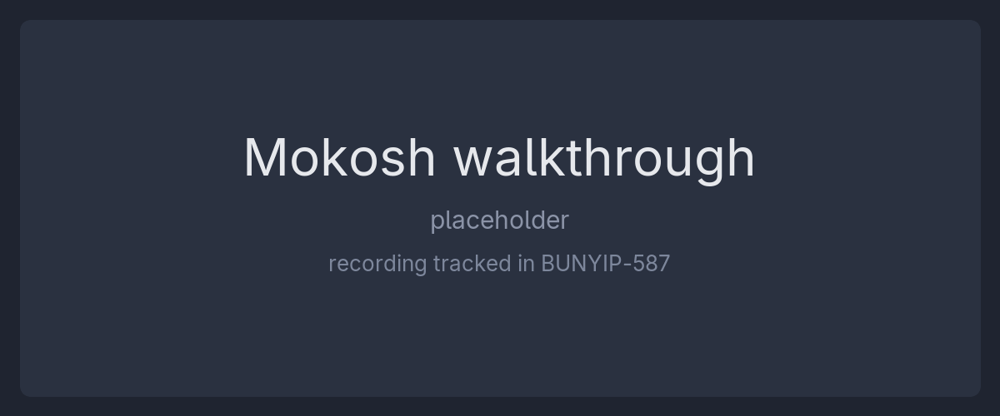

# Mokosh Apps

The client for the Mokosh PSA platform: one Dioxus source tree that builds as a WebAssembly SPA in the browser and as a native desktop application.

<!--
BUNYIP-587 records the shared Bunyip-to-Mokosh walkthrough GIF. When it lands,
commit a copy at docs/assets/mokosh-walkthrough.gif (a cross-repo relative path
to the Bunyip copy does not render on the mirrors, and hot-linking the raw asset
URL is fragile) and replace this comment with:

-->

## Try it

Live staging: **<https://msp.a8n.systems>**. This repository is what serves that page; sign in through the platform and click through the product.

> Staging shows features **in development**, not a polished demo. State is **wiped on every deploy** - accounts and data are throwaway. Do not reuse a real password.

## Documentation

Everything else is in [`docs/`](docs/README.md), indexed there in full:

- [quickstart.md](docs/quickstart.md) - get a fresh clone serving in the browser
- [architecture.md](docs/architecture.md) - the stack, the source layout, the cargo features, and what a build produces
- [recipes.md](docs/recipes.md) - the task runner, recipe by recipe
- [desktop.md](docs/desktop.md) - the native desktop build
- [self-hosting.md](docs/self-hosting.md) - run the published image, and every runtime environment variable
- [client-server-integration.md](docs/client-server-integration.md) - how this client reaches mokosh-server, and what the two repositories share on the wire

## Development happens on Forgejo

The development home for this repository is <https://dev.a8n.run/psa-systems/mokosh-apps>. The [GitHub](https://github.com/psa-systems/mokosh-apps) and [Codeberg](https://codeberg.org/psa-systems/mokosh-apps) copies are read-only mirrors that exist for visibility only: issues and pull requests are disabled there, and no community support runs on the mirrors. File issues and open pull requests on Forgejo.

## Security

Please do not report a suspected vulnerability through the public issue tracker, on Forgejo or on either mirror: filing it there publishes it. Contact a maintainer privately instead. A published disclosure address and a `SECURITY.md` are being set up and this section will link to them.

## License

Proprietary. See `Cargo.toml`; there is no separate license file.

## Authors and credits

Mokosh Apps is built by the Mokosh Platform Team at PSA Systems, and `Cargo.toml` carries the authoritative author and license fields.

Built on [Rust](https://www.rust-lang.org/), [Dioxus](https://dioxuslabs.com/), [WebAssembly](https://webassembly.org/) and [Tailwind CSS](https://tailwindcss.com/), driven by [just](https://github.com/casey/just), [Nushell](https://www.nushell.sh/) and [Bun](https://bun.sh/), and served in production by [Caddy](https://caddyserver.com/).
